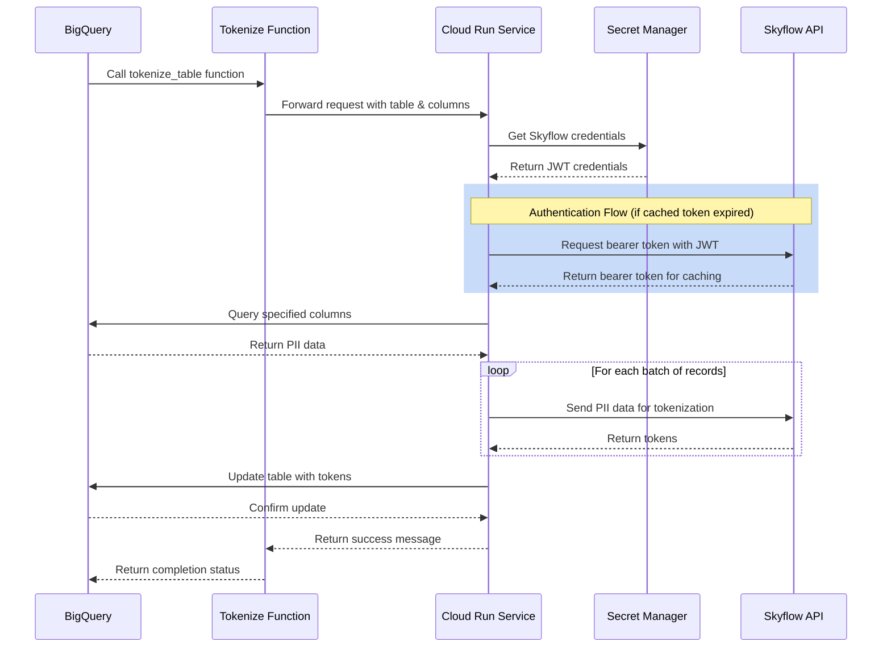
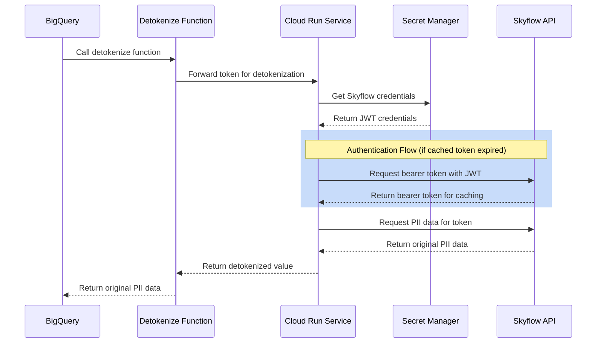

# BigQuery PII Tokenization with Skyflow

This solution provides a secure way to tokenize Personally Identifiable Information (PII) in BigQuery tables using Skyflow's tokenization service. By implementing a Cloud Run service that bridges BigQuery and Skyflow, organizations can protect sensitive data while maintaining data utility for analytics and processing.

## Table of Contents
- [Key Benefits](#key-benefits)
- [Architecture](#architecture)
- [Flow Diagrams](#flow-diagrams)
  - [Tokenization Flow](#tokenization-flow)
  - [Detokenization Flow](#detokenization-flow)
- [Features](#features)
- [Prerequisites](#prerequisites)
- [Setup Instructions](#setup-instructions)
- [Usage Examples](#usage-examples)
  - [Tokenizing PII Data](#tokenizing-pii-data)
  - [Detokenizing Data](#detokenizing-data)
- [Project Structure](#project-structure)
- [Error Handling](#error-handling)
- [Development Guide](#development-guide)
- [Cleanup](#cleanup)
- [Looker Studio Integration](#looker-studio-integration)
- [Support](#support)
- [License](#license)

## Key Benefits

- **Data Security**: Protect sensitive PII data through industry-standard tokenization
- **Regulatory Compliance**: Help meet GDPR, CCPA, and other privacy regulations
- **Seamless Integration**: Native BigQuery functions for easy implementation
- **High Performance**: Efficient batch processing for large datasets
- **Maintainable**: Clear separation of concerns with modular architecture

## Architecture

The solution consists of several components:

1. **BigQuery Remote Functions**: Three user-defined functions (UDFs) that call the Cloud Run service:
   - `<prefix>_skyflow_tokenize_table`: Converts PII data into tokens for entire table columns
   - `<prefix>_skyflow_tokenize`: Tokenizes individual values for comparisons
   - `<prefix>_skyflow_detokenize`: Retrieves original PII data from tokens

2. **Unified Cloud Run Service**: A Go-based microservice that:
   - Handles all tokenization and detokenization requests from BigQuery
   - Implements role-based access control (RBAC)
   - Manages Skyflow authentication with token caching
   - Processes data in configurable batches
   - Interfaces with Skyflow's API
   - Updates BigQuery tables atomically

## Flow Diagrams

### Tokenization Flow



### Detokenization Flow



## Features

- **Efficient Processing**: 
  - Batch processing with configurable batch sizes:
    - SKYFLOW_INSERT_BATCH_SIZE (default: 25) for tokenization
    - SKYFLOW_DETOKENIZE_BATCH_SIZE (default: 25) for detokenization
    - BIGQUERY_UPDATE_BATCH_SIZE (default: 1000) for table updates
  - Parallel processing with in-flight request caching
  - Atomic updates for data consistency
  - Bearer token caching for reduced API calls

- **Security**:
  - Role-based access control (RBAC) with configurable role mapping:
    - Project-agnostic configuration using ${PROJECT_ID} placeholder
    - Default role ID for unmapped roles
    - Flexible mapping between Google IAM roles and Skyflow role IDs
    - Support for multiple Google roles per Skyflow role
    - Easy to extend with additional role mappings
  - Operation-level access control for BigQuery functions
  - Secure credential management via Secret Manager
  - TLS encryption for all service communication
  - Minimal IAM permissions following least privilege
  - PII data never logged or stored temporarily
  - Token caching with thread-safe promise mechanism

- **Flexibility**:
  - Support for multiple columns in single request
  - Custom table and column selection
  - Real-time processing via Skyflow's API

## Prerequisites

1. **Google Cloud Project** with the following APIs enabled:
   - BigQuery API
   - Cloud Run API
   - Cloud Build API
   - IAM API
   - Secret Manager API

2. **Skyflow Account** with:
   - Valid JWT configuration
   - API access
   - Vault setup:
     1. Go to Skyflow Studio UI
     2. Create a new vault using vault_schema.json template provided in this repository
        - The template defines the vault structure for storing PII data
        - Includes table schema and field configurations
        - Optimized for BigQuery integration
     3. Create roles in the vault according to your organization's needs
        - Recommended role types (examples):
          * Role with full PII access (e.g. for audit, security teams)
          * Role with masked PII access (e.g. for customer service teams)
          * Role with no PII access (e.g. for analytics teams)
        - Note: These are example roles only. Create roles based on:
          * Your organization's security policies
          * Data access requirements
          * Compliance needs
     4. Record the role IDs of your created roles for use in role_mappings.json configuration

3. **Local Development Environment**:
   - macOS with Homebrew
   - Google Cloud SDK
   - Git

## Setup Instructions

1. Clone the repository:
   ```bash
   git clone <repository-url>
   cd gcp_bigquery_functions_udfs
   ```

2. Add required configuration files:

   a. Skyflow credentials file:
   - Create a service account in your Skyflow account
   - Download the generated credentials.json file
   - Place it in the project root directory

   b. Role mappings configuration:
   - Create role_mappings.json file in the project root directory
   - Configure with your Skyflow role IDs and Google IAM roles
   - Use ${PROJECT_ID} placeholder for project name
   - Example structure:
     ```json
     {
       "defaultRoleID": "your_default_role_id",
       "roleMappings": [
         {
           "skyflowRoleID": "your_admin_role_id",
           "googleRoles": [
             "projects/${PROJECT_ID}/roles/skyflow_admin",
             "additional_role_1"
           ]
         },
         {
           "skyflowRoleID": "your_cs_role_id",
           "googleRoles": [
             "projects/${PROJECT_ID}/roles/skyflow_cs",
             "additional_role_2"
           ]
         }
       ]
     }
     ```

3. Run setup script with your chosen prefix:
   ```bash
   ./setup.sh create your_prefix
   ```
   
   The script will:
   - Validate credentials.json and role_mappings.json formats
   - Convert prefix to lowercase and replace non-alphanumeric chars with underscores
   - Process role_mappings.json to use actual project ID
   - Prompt for configuration values (press Enter to use defaults):
     ```bash
     # Environment Variables
     PROJECT_ID="your-project-id"              # Google Cloud project ID
     REGION="your-project-region"              # ex. us-west1
     PREFIX="your-prefix"                      # Prefix for resources and functions
     
     # Skyflow Configuration
     SKYFLOW_ACCOUNT_ID="your-account-id"      # Skyflow account identifier
     SKYFLOW_VAULT_URL="your-vault-url"        # Skyflow vault URL
     SKYFLOW_VAULT_ID="your-vault-id"          # Skyflow vault identifier
     SKYFLOW_TABLE_NAME="pii"             # Skyflow table name
     
     # Batch Processing Configuration
     SKYFLOW_INSERT_BATCH_SIZE="25"            # Batch size for Skyflow tokenization requests
     SKYFLOW_DETOKENIZE_BATCH_SIZE="25"        # Batch size for Skyflow detokenization requests
     BIGQUERY_UPDATE_BATCH_SIZE="1000"         # Batch size for BigQuery table updates
     ```
   - Install required dependencies
   - Enable necessary Google Cloud APIs
   - Create and configure Secret Manager secrets
   - Deploy the unified Cloud Run service
   - Set up BigQuery dataset, tables, and functions
   - Configure IAM permissions

   Available script actions:
   ```bash
   ./setup.sh create your_prefix    # Initial setup
   ./setup.sh recreate your_prefix  # Destroy and recreate all components
   ./setup.sh destroy your_prefix   # Remove all components
   ```

## Usage Examples

### Tokenizing PII Data

The solution provides two tokenization functions:

1. **Table Tokenization** - For tokenizing columns in a table:
```sql
-- Tokenize PII columns in a table
SELECT `<project_id>.<dataset>.<prefix>_skyflow_tokenize_table`(
  '<project_id>.<dataset>.customer_data',  -- fully qualified table name
  'first_name,last_name,email,phone_number,date_of_birth'  -- comma-separated column names
);
```

2. **Single Value Tokenization** - For WHERE clause comparisons:
```sql
-- Find high-value customers by email
SELECT * FROM `<project_id>.<dataset>.customer_data`
WHERE email = `<project_id>.<dataset>.<prefix>_skyflow_tokenize`('john.doe@example.com')
  AND total_spent > 1000;

-- Search customers by multiple PII fields
SELECT * FROM `<project_id>.<dataset>.customer_data`
WHERE first_name = `<project_id>.<dataset>.<prefix>_skyflow_tokenize`('John')
   OR phone_number = `<project_id>.<dataset>.<prefix>_skyflow_tokenize`('+1-555-0123');

-- Find customers who haven't logged in recently
SELECT * FROM `<project_id>.<dataset>.customer_data`
WHERE email IN (
    SELECT `<project_id>.<dataset>.<prefix>_skyflow_tokenize`(email)
    FROM inactive_users_list
)
AND last_login < TIMESTAMP_SUB(CURRENT_TIMESTAMP(), INTERVAL 30 DAY);
```

### Detokenizing Data

The detokenize function can be used in various ways:

1. **Basic Detokenization**:
```sql
-- Customer service view with masked PII
SELECT 
    customer_id,
    `<project_id>.<dataset>.<prefix>_skyflow_detokenize`(first_name) as first_name,
    `<project_id>.<dataset>.<prefix>_skyflow_detokenize`(last_name) as last_name,
    `<project_id>.<dataset>.<prefix>_skyflow_detokenize`(email) as email,
    `<project_id>.<dataset>.<prefix>_skyflow_detokenize`(phone_number) as phone_number,
    address,
    signup_date,
    last_login,
    total_purchases,
    total_spent,
    loyalty_status,
    preferred_language
FROM `<project_id>.<dataset>.customer_data`
WHERE loyalty_status = 'GOLD';
```

2. **Combined with Tokenization**:
```sql
-- Marketing analysis with consent check
SELECT 
    loyalty_status,
    COUNT(*) as customer_count,
    AVG(total_spent) as avg_spent,
    `<project_id>.<dataset>.<prefix>_skyflow_detokenize`(
        ARRAY_AGG(email ORDER BY total_spent DESC LIMIT 1)
    ) as top_spender_email
FROM `<project_id>.<dataset>.customer_data`
WHERE consent_marketing = TRUE
GROUP BY loyalty_status
ORDER BY avg_spent DESC;
```

## Project Structure

```
.
├── cloud_run/                             # Cloud Run service
│   └── skyflow/                          # Service implementation
│       ├── main.go                       # Service implementation
│       └── go.mod                        # Go dependencies
├── sql/                                  # SQL definitions
│   ├── create_detokenize_function.sql    # Detokenization UDF
│   ├── create_tokenize_table_function.sql # Table tokenization UDF
│   ├── create_tokenize_value_function.sql # Value tokenization UDF
│   ├── example_queries.sql               # Example usage queries
│   └── insert_sample_data.sql           # Sample data insertion
├── config.sh                             # Environment configuration
├── google_cloud_ops.sh                   # GCP operations helper
├── LICENSE                               # License file
├── README.md                             # Project documentation
├── role_mappings.json                    # Role mapping configuration
├── setup.sh                              # Main deployment script
└── vault_schema.json                     # Vault schema configuration
```

## Error Handling

The service implements comprehensive error handling:

- **Input Validation**:
  - Data format verification
  - Column existence checks
  - Role-based access validation
  
- **Service Errors**:
  - Authentication failures
  - Network timeouts
  - API rate limits
  - Database constraints

- **Recovery Mechanisms**:
  - Token promise system for concurrent request handling
  - Batch failure isolation with independent error handling
  - Transaction rollbacks for atomic updates
  - Detailed error reporting with context
  - In-flight request caching to prevent duplicate processing
  - Bearer token caching with thread-safe access

## Development Guide

1. **Local Testing**:
   ```bash
   # Run service locally
   cd cloud_run/skyflow
   go run main.go
   ```

2. **Deploying Changes**:
   ```bash
   # Rebuild and deploy service
   ./setup.sh recreate your_prefix
   ```

3. **Monitoring**:
   - View Cloud Run logs in Google Cloud Console
   - Check BigQuery audit logs for function usage
   - Monitor Skyflow API quotas

## Cleanup

Remove all created resources:
```bash
./setup.sh destroy your_prefix
```

This will clean up:
- Cloud Run service
- BigQuery functions, dataset, and tables
- Secret Manager secrets
- IAM bindings
- Service accounts

## Looker Studio Integration

The detokenization function can be used directly in Looker Studio dashboards to ensure PII is protected:

Marketing View:


PII Admin View:


1. **Create a New Data Source**:
   - In Looker Studio, click "Create" > "Data Source"
   - Select "BigQuery" as the connector
   - Choose your project, dataset, and table

2. **Custom Query Data Source**:
   - Basic Query Example:
     ```sql
     SELECT 
       customer_id,
       `${PROJECT_ID}.${DATASET}.${PREFIX}_skyflow_detokenize`(email) as email,
       `${PROJECT_ID}.${DATASET}.${PREFIX}_skyflow_detokenize`(first_name) as first_name,
       `${PROJECT_ID}.${DATASET}.${PREFIX}_skyflow_detokenize`(last_name) as last_name,
       address,
       total_purchases,
       total_spent,
       loyalty_status
     FROM `${PROJECT_ID}.${DATASET}.${TABLE}`
     ```
   
   - Optimized Query with Aggregations:
     ```sql
     WITH customer_metrics AS (
       SELECT 
         loyalty_status,
         COUNT(*) as customer_count,
         AVG(total_spent) as avg_spent,
         SUM(total_purchases) as total_purchases
       FROM `${PROJECT_ID}.${DATASET}.${TABLE}`
       GROUP BY loyalty_status
     )
     SELECT 
       cm.*,
       `${PROJECT_ID}.${DATASET}.${PREFIX}_skyflow_detokenize`(
         ARRAY_AGG(email ORDER BY total_spent DESC LIMIT 1)
       ) as top_customer_email
     FROM customer_metrics cm
     LEFT JOIN `${PROJECT_ID}.${DATASET}.${TABLE}` t
       ON cm.loyalty_status = t.loyalty_status
     GROUP BY cm.loyalty_status, cm.customer_count, cm.avg_spent, cm.total_purchases
     ```

3. **Field Configuration**:
   - The detokenized fields (email, first_name, last_name) appear as regular text fields
   - Apply standard Looker Studio formatting and aggregations
   - Create calculated fields combining detokenized data:
     ```sql
     CONCAT(
       ${PREFIX}_skyflow_detokenize(first_name), ' ',
       ${PREFIX}_skyflow_detokenize(last_name)
     ) as full_name
     ```

4. **Data Source Settings**:
   - In the data source configuration, select "Viewer's Credentials"
   - This ensures each user can access the data with their own permissions

5. **Best Practices**:
   - Use filters to limit the amount of detokenized data displayed
   - Set appropriate dashboard refresh intervals
   - Cache dashboard results to minimize API calls

## Support

For issues and feature requests, please contact your Skyflow representative or open an issue in the repository.

## License

This project is licensed under the MIT License - see the LICENSE file for details.
